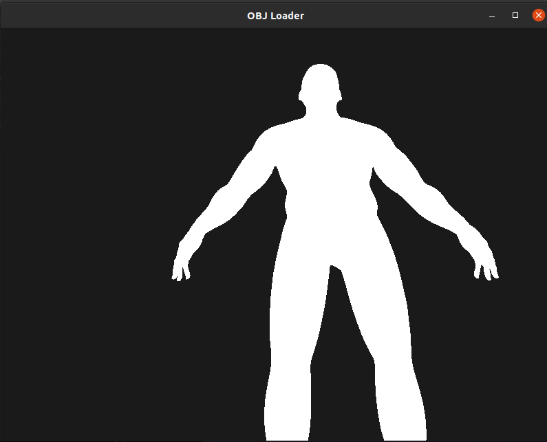

# OpenGL Basic Mesh Renderer

This is a basic 3D OpenGL mesh renderer in pure C with no abstraction to see the raw implementation. Uses tinyobj_loader to read in the vertices

features: 

- WASD + Mouse controls to see
- raw vertice rendering (no materials, etc.)




# How to Compile:


Ubuntu (24.04):

```
sudo apt install build-essential
sudo apt install git
sudo apt install libglew-dev
sudo apt install libglfw3
sudo apt install libglfw3-dev
sudo apt install libcglm-dev


gcc  -o ./mesh_renderer ./src/mesh_renderer.c  -g -lm -lglfw -lGLEW -lGL
```

then run with `./mesh_renderer`

